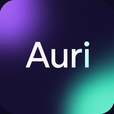
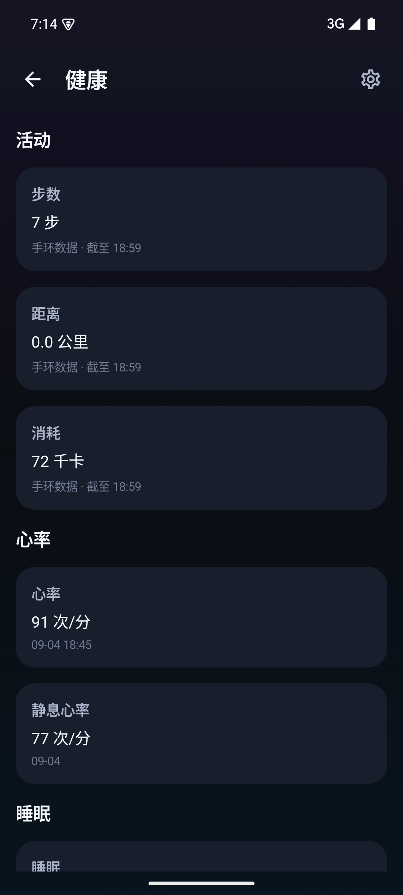
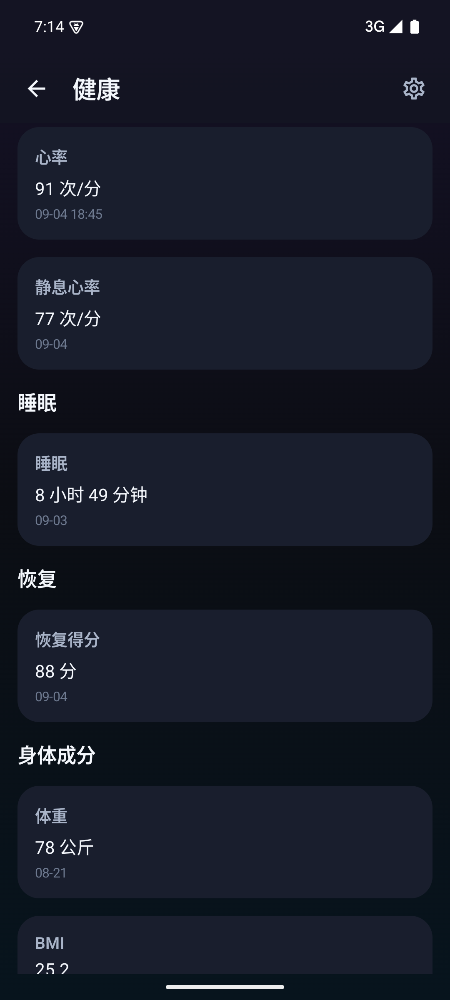
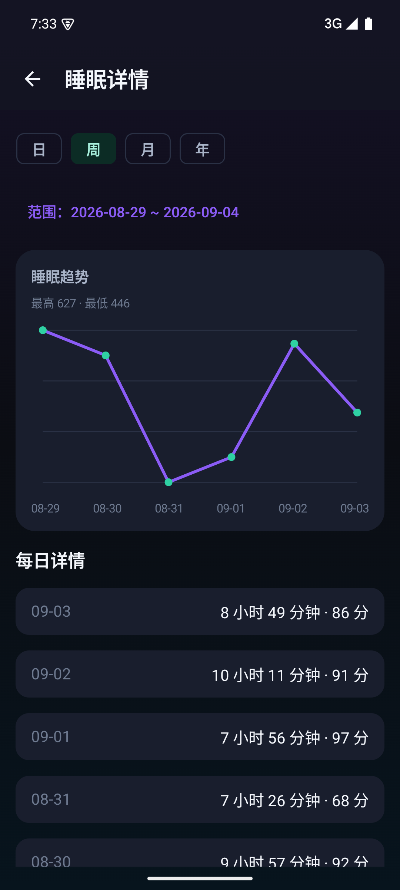

<p align="center">
  
</p>

<h1 align="center">Auri</h1>
<p align="center"><strong>主动找你，慢慢懂你。</strong></p>
<p align="center">一个拥有长期记忆、主动联系能力和健康数据感知的个人 AI Agent。</p>
<p align="center">
  <a href="https://auri.thinktocode.online/">官网</a> ·
  <a href="https://auri.thinktocode.online/download">Android 下载</a> ·
  <a href="docs/GETTING_STARTED.md">自部署</a> ·
  <a href="docs/ARCHITECTURE.md">架构</a> ·
  <a href="README.en.md">English</a>
</p>

## 为什么做 Auri

许多 AI 应用需要你打开一个新会话，重新介绍自己，再提出一个明确的问题。我想探索另一种体验：在一个持续的聊天窗口里，慢慢建立共同的上下文。你可以随手分享生活、提出问题，也可以继续几天前的话题；Auri 会根据记忆和可用情境，判断什么时候值得主动联系你。

Auri 的主界面是一段长对话。它可以查资料、看图片、读文件、和你一起安排日程，也可以在你授权后连接健康数据。健康是帮助理解日常的一种信息来源，并不是使用 Auri 的前提。

这是由个人开发者持续维护的 Android + FastAPI 项目。**服务端和 Android 客户端完整业务源码都在本仓库中**，包括记忆、主动消息、账号、健康、Credits、支付宝对接、后台管理、官网和直装更新逻辑。你可以研究实现、修改产品或部署自己的实例。

当前开源版本基于 Android **0.3.28 / versionCode 31** 及 2026-09-07 的配套服务端。官方服务、源码和第三方自部署实例是不同的运行环境；开源不包含官方服务的用户数据、访问权限、签名或供应商凭据。

## Auri 能做什么

| 能力 | 已有实现 | 使用条件与边界 |
|---|---|---|
| 连续聊天 | 同一账号持续会话、分页历史、客户端缓存、消息幂等重试 | 默认不按天重置 |
| 好友式回应 | 先确认发送，后台规划回复时机，支持连续发送 | 问题和任务不能因自然收尾策略而永久沉默 |
| 长期记忆 | 用户偏好、持久笔记、结构化事件、纠错与渐进遗忘 | 记忆质量取决于模型；需要持续观察 |
| 主动联系 | 根据对话、记忆、健康、位置、天气等证据决定是否联系 | 全局配置和用户开关控制；无关或不新鲜证据不能充当当前事实 |
| 主动节奏 | 区分分享与提问、曝光确认、回复归因、冷却和恢复探测 | 未曝光不能直接视为用户拒绝互动 |
| 健康 | 小米云同步、活动/心率/睡眠/运动记录、趋势与双睡眠评分 | 小米集成为实验性非官方适配；不是医疗诊断 |
| 日程 | 月历、手动安排、聊天读写、全天/跨天、重复事项和到点提醒 | 日程只表示计划；不等于用户实际正在执行 |
| 图片和文件 | 最多 4 张图片或 4 个文件；常见文档文本解析 | 图片需要可用的视觉模型；不是所有文件都可解析 |
| 工具 | 日程、搜索、网页、天气、位置、计算、单位换算、日期、提醒、待办 | 外部能力需单独配置；定位需设备授权与在线回传 |
| 账号 | 邮箱注册/登录、验证码、找回/修改密码、注销 | 生产邮件需自己的 Resend 配置 |
| Credits | 余额、调用扣费、欢迎额度、订单账本、支付宝回调 | 默认关闭扣费和支付；收费方是各实例运营者 |
| 可观测性 | Token/轮次/工具耗时、主动情境审计，以及总览、用户/Credits、调用、发布和系统状态后台 | 计价代码是项目内费率表，不能直接等同供应商账单；后台需要独立强密码 |
| Android 分发 | `direct` 官网自更新、`store` 无应用内安装版本 | 提供构建渠道不代表商店审核已通过 |

## 一次聊天如何发生

1. Android 为消息生成唯一 ID，先把“发送是否成功”和“AI 是否回复”分开处理。
2. 服务端保存消息并返回确认。客户端无需一直等待模型，可以继续发消息。
3. 持久队列规划快速、普通、暂时离开或自然收尾等行为；生成前到达的连续消息可以合并。
4. Agent 读取相关记忆，必要时调用工具；事实来自工具结果，不把缺失数据编造为已知状态。
5. 真正生成时，聊天页顶部显示“正在输入…”。完整回复落库后，通过增量轮询显示，并按配置发送推送。
6. 后续事件提取和记忆维护，把新出现的事实与历史上下文连接起来。

普通聊天的开放式回答不是确定性输出。无 API Key 的本地 Echo 模式只能用于验证接口与客户端连接，不能代表真实智能效果。

## 主动联系如何避免变成轰炸

Auri 不是每隔固定时间发一句随机问候。定时任务或健康/天气等事件先触发评估，再经过免打扰、节奏和待回复数量检查。模型需要给出是否联系的判断与证据引用，投放前还会核验。

投放账本分别记录聊天落库、推送接受、客户端曝光、用户回复和结算。纯分享不要求回复，未知曝光不直接累计未回复惩罚。用户长时间不回复后会进入休息并逐步尝试低压恢复；用户也可以直接在聊天里表达“少找我一点”或“先安静”。

这些机制已经实现，但它们无法保证每一次问候都恰当。欢迎反馈具体情境、预期行为和脱敏复现步骤。

## 记忆如何工作

- **持久笔记**：相对稳定的用户事实和偏好，有容量预算。
- **观察记录**：对话、健康、天气等来源的统一记录，按需要检索。
- **事件时间线**：区分消息时间与事件时间，记录计划、进行中、完成、取消及纠错关系。
- **渐进遗忘**：保留事件骨架，让低显著度细节逐渐退出自动召回；用户纠错等受保护信息另行处理。
- **上下文压缩**：长期原始聊天保存在存储中，模型主要读取滚动摘要和近期尾部，避免无限增长的提示词。

实现细节及数据落点见 [架构说明](docs/ARCHITECTURE.md)。

## 界面预览

下面是官网已公开展示的健康界面截图，用于说明 UI；不是随仓库提供的健康数据集，也不代表新部署实例会自带这些数据。

<p>
  
  
  
</p>

## 仓库结构：一个产品，一个仓库

```text
Auri-open-source/
├── server/                 # FastAPI、Agent、全部业务服务、测试、官网
├── android/                # Kotlin + Jetpack Compose Android 客户端
├── docs/                   # 产品、部署、架构、配置、开发、路线图
├── scripts/                # 可复用本地验证工具
├── LICENSES/               # 上游许可证原文
├── .github/                # CI、Issue 和 PR 模板
├── CONTRIBUTING.md
├── SECURITY.md
└── THIRD_PARTY_NOTICES.md
```

两端通过 HTTP API 通信，仍有各自的依赖、构建和许可证。把代码放在同一个仓库，可以让接口变更、客户端适配和文档在同一个 PR 中评审；使用者一次 clone 即可得到完整项目。

## 快速启动服务端

推荐 Python 3.12。以下是 Linux/macOS 命令，Windows PowerShell 和完整 Android 连接步骤见 [快速开始](docs/GETTING_STARTED.md)。

```bash
git clone https://github.com/strongterman-hub/Auri-open-source.git
cd Auri-open-source/server
python3.12 -m venv .venv
source .venv/bin/activate
python -m pip install -e '.[dev]'
cp .env.example .env
python -m uvicorn app.main:app --host 127.0.0.1 --port 8010
```

- 健康检查：`http://127.0.0.1:8010/v1/health`
- OpenAPI：`http://127.0.0.1:8010/docs`
- 网站源码入口：`http://127.0.0.1:8010/`
- 默认 Echo 模式，无需模型 Key；支付、邮件验证、主动调度和云健康同步默认关闭。
- 网站下载按钮需要实例自己的 APK 元数据，初始无 APK 时显示不可用属于预期；它不会自动托管官方安装包。

接真实模型时，在本地 `.env` 配置 `AURI_LLM_PROVIDER=openai-compatible`、`AURI_LLM_BASE_URL`、`AURI_LLM_API_KEY` 和供应商实际支持的 `AURI_LLM_MODEL`。模型需支持 Chat Completions 兼容的流式响应与工具调用；不同供应商仍需验证兼容性。

## Android 构建

需要 JDK 17、Android SDK 35 和 Gradle 8.9；也可用 Android Studio 打开 `android/`。

```bash
cd android
gradle :app:assembleStoreDebug
```

Debug 默认连接 Android 官方模拟器的宿主机 `http://10.0.2.2:8010/v1`，默认包名为 `com.auri.community.debug`，避免覆盖官方应用。真机、自建 HTTPS 地址、签名、推送与渠道差异见 [Android 指南](docs/ANDROID.md)。正式包默认不带官方签名，不带官方推送配置。

## 自部署需要哪些服务

最小本地运行只需要 Python。连接真实 LLM 后可进行聊天和工具调用。其他集成按需开启：

| 服务 | 用途 | 没有配置时 |
|---|---|---|
| Chat Completions 兼容模型 API | 对话、事件提取、主动决策 | Echo 回显 |
| 视觉模型 | 图片理解 | 不应宣称图片理解可用 |
| JPush | Android 系统通知 | App 内轮询仍可用，后台通知不可用 |
| Resend | 验证码、找回/修改密码 | 本地 API 可关闭注册验证码；邮件流程不可用 |
| 小米账号及凭据加密密钥 | 云健康同步 | 普通聊天不依赖绑定小米 |
| 搜索服务 | 联网检索 | 默认关闭；网页工具另受网络可达性影响 |
| Open-Meteo / 位置服务 | 天气及地点信息 | 缺少授权/来源时应明确不可用或回退 |
| 支付宝商户配置 | Credits 充值 | 默认禁用支付，默认不强制扣费 |

部署与数据保护见 [自部署指南](docs/DEPLOYMENT.md)，完整设置索引见 [配置参考](docs/CONFIGURATION.md)。

## 当前边界

- Android 已实现，尚无 iOS 或原生鸿蒙客户端。
- 小米健康云集成来自社区协议适配，不是小米官方合作 SDK；接口、地区、账号状态及设备支持可能变化。开源许可证不授予第三方平台接口的商业使用权。
- 健康评分用于个人观察，不构成医学诊断；缺少真实 HRV 时不能声称存在 HRV 数据。
- 当前推送采用 JPush；厂商离线通道仍需运营者申请、配置和真机验证。系统接受推送不等于用户实际看到了消息。
- 前瞻 `intents` 目前只有 CRUD，不能把所有自然语言条件承诺为已实现的触发器；定时/健康条件提醒是独立已有模块。
- `phone_state` 观察源尚无完整真实实现；日程已由共享日程服务直接提供给聊天和主动情境。
- 默认部署是单进程模型：队列、调度器、JSON 文件及部分进程内状态尚未构成多 worker/多副本一致性方案。
- 生产账号、聊天、健康、支付流水、密钥、签名和运维历史不属于源码发行内容。
- 部署公众服务时，需要由实际运营者处理适用的隐私、内容安全、备案、支付及第三方授权要求；源码公开不等于已完成这些手续。

## 文档导航

- [产品设计与能力详解](docs/PRODUCT.md)
- [快速开始与本地验证](docs/GETTING_STARTED.md)
- [架构、请求链路与存储](docs/ARCHITECTURE.md)
- [配置参考](docs/CONFIGURATION.md)
- [Android 构建、签名与渠道](docs/ANDROID.md)
- [服务器部署、备份和运维](docs/DEPLOYMENT.md)
- [开发与测试](docs/DEVELOPMENT.md)
- [路线图](docs/ROADMAP.md)
- [首次开源说明与验证范围](docs/RELEASE_NOTES.md)
- [贡献指南](CONTRIBUTING.md) · [安全反馈](SECURITY.md)

## 贡献与反馈

欢迎报告能复现的问题、改进文档、增加集成测试，或讨论主动联系与记忆的实际体验。优先处理能让现有链路更可靠的改进。提交 Issue 前请删除聊天隐私、账号信息、定位、健康记录和任何凭据。

## 许可证与致谢

本仓库按目录授权：**服务端及根目录文档/工具采用 AGPL-3.0-only，独立 Android 客户端的原创代码采用 MIT**。`server/app/integrations/xiaomi/qr_login.py` 的 GPL-3.0 上游授权及其他第三方条款单独保留；GPLv3 与 AGPLv3 组合部分按相应条款处理。没有任何许可证将官方用户数据或密钥提供给使用者。

感谢 [mi-bridge](https://github.com/shkyyy18/mi-bridge)、[mi-fitness-mcp](https://github.com/kubulashvili/mi-fitness-mcp)、[mi-fitness-mcp-cn](https://github.com/binglua/mi-fitness-mcp-cn)、[mijia-api](https://github.com/Do1e/mijia-api) 及所有依赖项目。详细范围、上游许可和商标边界见 [第三方声明](THIRD_PARTY_NOTICES.md)。
