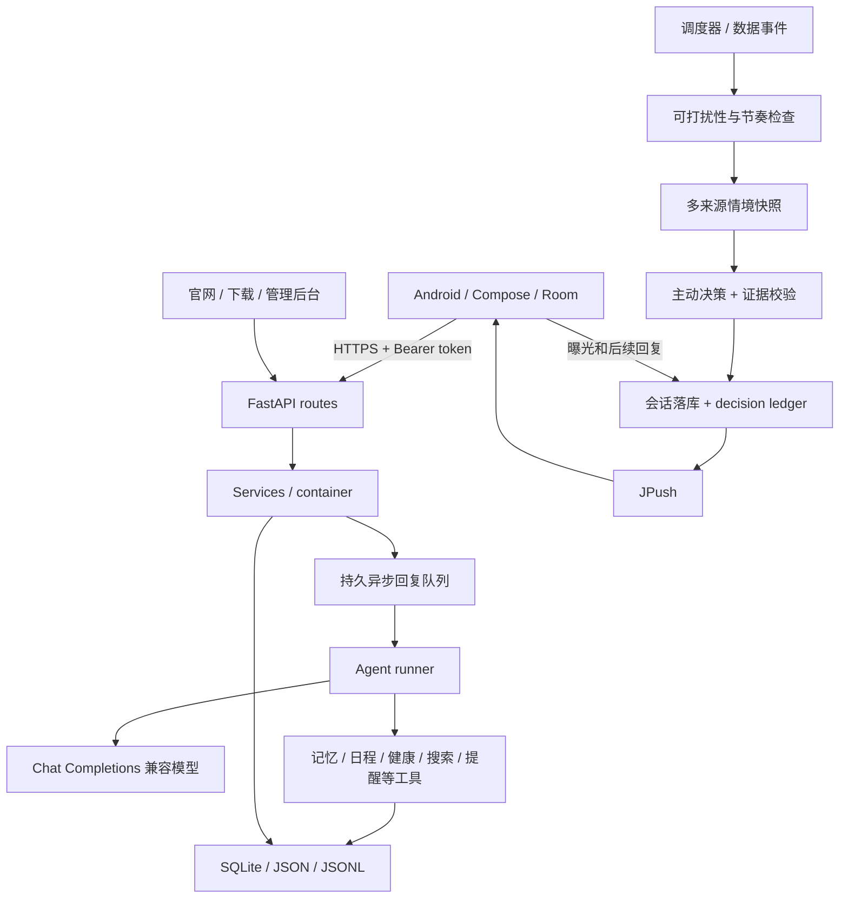

# 架构与数据链路

## 系统概览



## 分层

| 位置 | 职责 |
|---|---|
| `server/app/api/routes/` | 请求参数、鉴权依赖、HTTP 响应 |
| `server/app/services/` | 业务编排和跨存储协调 |
| `server/app/state/container.py` | 构建每个存储、服务、模型和工具 |
| `server/app/agent/` | 模型协议、工具循环、上下文压缩 |
| `server/app/chat/` | 回复计划、持久任务、租约、重试和调度 |
| `server/app/memory/` | 长期笔记、观察检索、事件及前瞻记录 |
| `server/app/proactive/` | 情境、决策、节奏、引导、投递、推送 |
| `server/app/health/` | 标准化指标、统计、睡眠评分和缓存 |
| `server/app/schedule/` | 共享日程、重复展开、例外、冲突和提醒调度 |
| `server/app/integrations/xiaomi/` | 非官方小米云协议、扫码登录与凭据 |
| `server/app/billing/` | Credits、支付订单、回调校验与幂等记账 |
| `android/app/src/main/java/com/auri/chat/` | Compose 页面、ViewModel、API 和 Room |

## 聊天时序

1. 用户消息的 UUID 是幂等键。同一消息重试不会创建多份。
2. `/messages/async` 保存消息并创建/合并回复批次，返回投递确认。
3. 队列区分 waiting/生成/重试等内部状态，通过对外 `reply_state` 表达 queued、typing、idle。
4. 回复规划器根据语义和安全/任务规则分别选择时间档位与 `micro/short/normal/detailed` 篇幅档位。问题、附件和明确任务不应静默结束；规划失败回退快速、简短回应。
5. Runner 为当前账号组装记忆与可用工具，执行模型调用循环。
6. 回复完整落库，客户端通过 `/updates` 读取增量；失败不会把已经发送成功的用户消息反标成发送失败。

队列可跨服务重启恢复，但并不代表整个系统已经支持多进程部署。其他调度器、JSON 写入与进程内在线状态仍有单进程约束。

## 记忆与时间

持久笔记采用预算约束；观察记录保存来源；事件提取使用带时间信息的当前用户输入，并读取前面最多 4 条有限对话来解析省略式回答。上下文只负责说明当前回答指向什么，新增 owner 事实仍只能来自当前用户消息。事件包含状态、故事线、来源和关系；纠错通过替代/修正关系处理，避免同一事实同时存在两个冲突答案。事件抽取另有不含正文的结果审计。

事件发生时间与消息接收时间分离。`current_until` 等边界限制“现在正在发生”的断言。计划不能被压缩为已完成，过去地点不能因主题相似而拼接为当前位置。

低/普通/高显著度细节的默认半衰期为 14/45/180 天；事件骨架和受保护纠错不随普通细节自动消失。再次提及可强化召回。相关值均可在配置中调整。

`intents` 当前仅提供存取，不是全功能自然语言条件执行系统。已有提醒调度器支持的定时/健康条件提醒应单独理解。

## 日程

Android 月历和普通聊天 `schedule` 工具读写同一个 `ScheduleService`。身份由登录账号或服务端工具范围绑定，客户端和模型都不能通过参数切换到其他用户。写入带请求幂等键和版本号；冲突需要明确接受，重复事项可只改本次或修改整个系列。

日程按事项所属 IANA 时区保存本地墙上时间并展开重复规则，全天结束日期采用不包含边界。提醒投递有独立去重记录，不会因时间到达自动把事项标成完成。聊天摘要不包含备注，标题和地点按不可信用户数据处理；主动情境只把日程视为计划，并在定时事项正在覆盖当前时段时降低无关打扰。

## 主动联系

触发、决策、投递分层。情境快照包含本地时间、对话、事件、日程、健康、GPS、天气、提醒、待办、在线信息与节奏状态。每个来源都带可用性和新鲜度；单个来源失败不阻止整个评估。

确定性规则先决定是否允许打扰，模型再提供 `should_message` 与证据引用。对话源除即时尾部外，还独立派生 72 小时内最近 12 条用户中心问答，避免助手消息挤掉用户刚提供的答案。提问、软问候、记忆回访、探索和目标提醒进入额外连续性检查，返回 safe、rewrite 或 block；已有答案时从答案继续或静默。投递前仍校验证据，避免把天气回退坐标当成用户当前位置，也避免无数据时声称用户在运动。

decision ledger 保存消息投放、推送结果、客户端 inbox ack、回复、结算、主题和连续性结果；不复制消息正文。互动期待区分 `share`、`soft_check_in`、`direct_question`。只有已曝光且期待回复的消息进入未回复加权计算。冷却、休息和探测恢复替代永久封锁。用户明确指出连续性错误时，该消息结算但不计积极回复，并在有限时间内暂停新互动问题。

新用户引导有 dense/slow/done 阶段，以及超时 deferred 状态，避免一个未回答问题永久卡住后续引导。

## 健康数据

```text
设备 → 小米运动健康 App → 小米健康云 → Auri 服务端 → SQLite → Android Room/页面
```

这里没有直接读取所有蓝牙设备，也没有把米家设备自动等同为小米健康云设备。是否可读取决于账号、地区、设备类型和实际云数据。

设备源与 `hlth.gen_*` 综合源同时存在时，步数/距离优先综合源、设备源回退；热量采用独立的设备源优先规则，不能双源相加。指标保留来源和源更新时间。

日汇总按用户时区归日，样本时间保存 UTC。睡眠双分分别表达睡眠健康与生理恢复；只对明确的主睡眠生成夜间分。HRV 必须来自实际字段，缺失不能推算成已测量值。

## 存储与数据边界

`AURI_DATA_DIR` 是实例的数据根目录。主要包括：

| 数据 | 存储 |
|---|---|
| 账号和 token 摘要 | `auth/` 下的 JSON；验证码为 SQLite |
| 连续会话和压缩摘要 | `sessions/` 下的 JSON |
| 持久笔记、观察和事件 | `memory/` 下的 JSON + SQLite |
| 健康指标与样本 | `health/health.db` |
| 日程系列、单次例外和投递去重 | `schedule/schedule.db` |
| 聊天回复任务 | `chat/replies.db` |
| 推送 token、位置 | `devices/` 下的 SQLite |
| Credits 和订单 | `billing/` 下的 SQLite |
| 主动节奏、偏好、账本 | `proactive/` 等模块配置的 SQLite |
| 工具、模型调用审计 | `logs/` 下的 JSONL |
| 文件附件、小米凭据、提醒、更新包 | 对应业务子目录 |

具体文件名以各 Store 构造及 `container.py` 为准。用户邮箱当前是跨模块身份键，部分路径采用哈希目录；更改邮箱不能只修改登录记录。保留的 `deploy/migrate_user_email.py` 支持 dry-run 与关联迁移，使用前备份并检查目标冲突。

密码采用 PBKDF2-SHA256，登录 token 仅保存摘要。小米凭据加密密钥、验证码签名密钥和支付密钥必须由运营者持久保存，不进入仓库。

## 接口约定

所有业务 API 默认以 `/v1` 开头；后台 `/admin` 使用独立会话。权威接口见运行实例的 `/openapi.json` 与 `/docs`，避免将手写文档当作完整 schema。

账号授权应始终由 `CurrentUserDep` 校验；前端传入的 `user_id` 不构成访问其他用户数据的授权。新增工具必须明确读写副作用，主动消息可用工具保持受限，不能自动使用普通聊天的所有写入工具。
